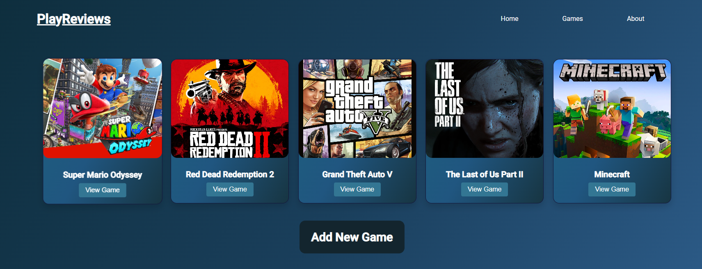

# PlayReviews 🎮

### About the project

"PlayReviews" is an app where the users can browse games and share their game reviews. They can add new games, update an existing game, delete a game and see the details and the reviews of any specific game.

The purpose of the app is to study the basic concepts of Angular by creating a fully functional Angular App using the fundamental concepts, like:
- Components
- Directives
- Services
- Dependency Injection
- Observables
- Routing
- Modules

#### Functionalities

The project has the functionalities of displaying a list of games, show their details page which contains a tab for the game info and a tab for the reviews of that game. It allows users to add new games to the database, as well as edit a game and delete a game. A user can also add reviews to a game, and delete a review too. There are some error handling and validation to ensure data integrity.

### Built with 🛠️

##### The project was built using some of the following technologies:

- Angular
- Material-UI
- TypeScript
- NodeJS
- Express
- Rest API concepts
- MongoDB

### Run it locally

1. Clone the repo
   ```sh
   https://github.com/JoseAntonio5/play-reviews-app.git
   ```
2. cd into `play-reviews\backend`

3. Use `npm install` to install the dependencies

4. Run `npm start` from the backend folder
Optional: You can open `http://localhost:3000/api/games/` if you want to see some API info in your browser.

5. In another terminal cd into `play-reviews\frontend`

6. Use `npm install` to install the dependencies

7. Run `ng serve --open`
You browser will open the app on `http://localhost:4200/`

### Screenshots

> Home page of PlayReviews

> List of all games

> Form page to add a new game

> Page with some more specific game details

> Tab with the reviews of the game


#### Author
José Antônio ©️ 2023